# 1  ELK介绍


# 2、环境准备

## 2.1  JDK安装

安装到/usr/java/jdk1.8.0_161目录下

```
sudo rpm -ivh jdk-8u161-linux-x64.rpm
```

修改系统环境变量文件。sudo vim /etc/profile

```
JAVA_HOME=/usr/java/jdk1.8.0_161
JRE_HOME=/usr/java/jdk1.8.0_161/jre
PATH=$PATH:$JAVA_HOME/bin:$JRE_HOME/bin
CLASSPATH=.:$JAVA_HOME/lib/dt.jar:$JAVA_HOME/lib/tools.jar:$JRE_HOME/lib
export JAVA_HOME JRE_HOME PATH CLASSPATH
```

执行	`source /etc/profile`

验证

```
java -version
```


## 2.2 ElasticSearch安装

### 2.2.1 yum安装

**1** 导入签名

```
rpm --import https://artifacts.elastic.co/GPG-KEY-elasticsearch
```

**2.**从仓库安装

sudo vim /etc/yum.repos.d/elasticsearch.repo

```
[elasticsearch-7.x]
name=Elasticsearch repository for 7.x packages
baseurl=https://artifacts.elastic.co/packages/7.x/yum
gpgcheck=1
gpgkey=https://artifacts.elastic.co/GPG-KEY-elasticsearch
enabled=1
autorefresh=1
type=rpm-md
```

**3** yum 安装

```
yum install elasticsearch
```

### 2.2.2  rpm安装

```
wget https://artifacts.elastic.co/downloads/elasticsearch/elasticsearch-7.0.1-x86_64.rpm
wget https://artifacts.elastic.co/downloads/elasticsearch/elasticsearch-7.0.1-x86_64.rpm.sha512
shasum -a 512 -c elasticsearch-7.0.1-x86_64.rpm.sha512 
sudo rpm --install elasticsearch-7.0.1-x86_64.rpm
```


启动

```
sudo systemctl start elasticsearch
sudo systemctl enable elasticsearch
sudo systemctl status elasticsearch
```


验证：

```
curl http://10.30.5.33:9200
```


```
9300是tcp通讯端口，集群间和TCPClient
```


### 2.2.3 配置文件

/etc/elasticsearch/elasticsearch.yml

```
# 数据存储目录【需要确保elasticsearch用户访问权限】
#chown -R elasticsearch:elasticsearch /home/data/elasticsearch
path.data: /var/lib/elasticsearch
# 日志存储目录
path.logs: /var/log/elasticsearch
# 监听IP地址
network.host: 10.30.5.33
#自定义监听端口
http.port: 9200

# 个别机器设置无效
#discovery.seed_hosts: ["10.30.5.33"]

node.name: node-1
cluster.initial_master_nodes: ["node-1"]

```


### 2.2.4 遇到问题

1、 node validation exception [1] bootstrap checks failed

```
[ERROR][o.e.b.Bootstrap          ] [dev-node02] node validation exception
[1] bootstrap checks failed
[1]: the default discovery settings are unsuitable for production use; at least one of [discovery.seed_hosts, discovery.seed_providers, cluster.initial_master_nodes] must be configured
```

A： 如错误提示描述，修改network.host: 10.30.5.33后必须添加Discory声明，

```
discovery.seed_hosts: ["10.30.5.33"]


#node.name: node-1
# 与上面声明的node.name匹配
#cluster.initial_master_nodes: ["node-1", "node-2"]
```


2、node validation exception [1] bootstrap checks failed

```
[ERROR][o.e.b.Bootstrap          ] [m2M7ykG] node validation exception
bootstrap checks failed
max file descriptors [4096] for elasticsearch process likely too low, increase to at least [65536]
max number of threads [1024] for user [elsearch] likely too low, increase to at least [2048]
max virtual memory areas vm.max_map_count [65530] likely too low, increase to at least 
```

A：修改系统参数

1. 切换到root用户
vim /etc/security/limits.conf

```
* soft nofile 65536

* hard nofile 131072

* soft nproc 2048

* hard nproc 4096
```

```
soft nproc:可打开的文件描述符的最大数(软限制)
hard nproc:可打开的文件描述符的最大数(硬限制)
soft nofile:单个用户可用的最大进程数量(软限制)
hard nofile:单个用户可用的最大进程数量(硬限制)
```

2. vim /etc/sysctl.conf  ,在最后添加一行

```
vm.max_map_count=262144
```

修改完后，执行如下命令 sysctl -p


## 2.3 Kibana安装

### 2.3.1  安装

```
sudo rpm -ivh kibana-7.0.1-x86_64.rpm
```

### 2.3.2 配置连接ES

sudo vim /etc/kibana/kibana.yml

```
server.host: "10.30.5.33"

elasticsearch.hosts: ["http://10.30.5.33:9200"]
```


2.3.3  启动服务，开机启动

```
sudo systemctl start kibana
sudo systemctl enable kibana
```


## 2.4  FileBeat安装

1  安装

```
sudo rpm -ivh filebeat-7.0.1-x86_64.rpm
```

2  配置文件所在位置，  sudo vim /etc/filebeat/filebeat.yml

```

output.elasticsearch:
  # Array of hosts to connect to.
  hosts: ["10.30.5.33:9200"]
```

3 启动服务

```
sudo systemctl start filebeat
sudo systemctl enable filebeat
sudo systemctl status filebeat
```


# 3 Elasticsearch


# 4 FileBeat

## 4.1  FileBeat介绍

轻量型日志采集器。

​	当您要面对成百上千、甚至成千上万的服务器、虚拟机和容器生成的日志时，请告别 SSH 吧。Filebeat 将为您提供一种轻量型方法，用于转发和汇总日志与文件，让简单的事情不再繁杂。

**汇总、“tail -f” 和搜索**

​	启动 Filebeat 后，打开 Logs UI，直接在 Kibana 中观看对您的文件进行 tail 操作的过程。通过搜索栏按照服务、应用程序、主机、数据中心或者其他条件进行筛选，以跟踪您的全部汇总日志中的异常行为。

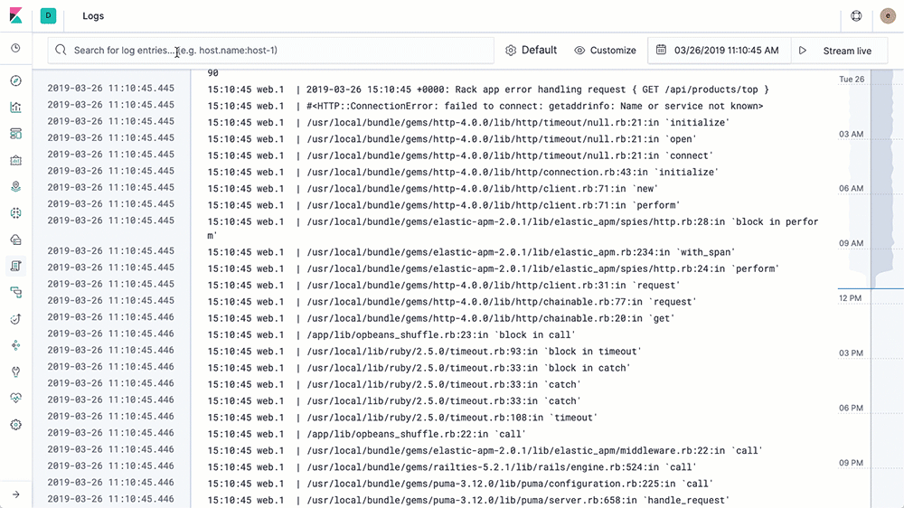

**性能稳健，不错过任何检测信号**

无论在任何环境中，随时都潜伏着应用程序中断的风险。Filebeat 能够读取并转发日志行，如果出现中断，还会在一切恢复正常后，从中断前停止的位置继续开始。

**Filebeat 让简单的事情简单化**

Filebeat 内置有多种模块（auditd、Apache、NGINX、System、MySQL 等等），可针对常见格式的日志大大简化收集、解析和可视化过程，只需一条命令即可。之所以能实现这一点，是因为它将自动默认路径（因操作系统而异）与 Elasticsearch 采集节点管道的定义和 Kibana 仪表板组合在一起。不仅如此，数个 Filebeat 模块还包括预配置的 Machine Learning 任务。

**System**

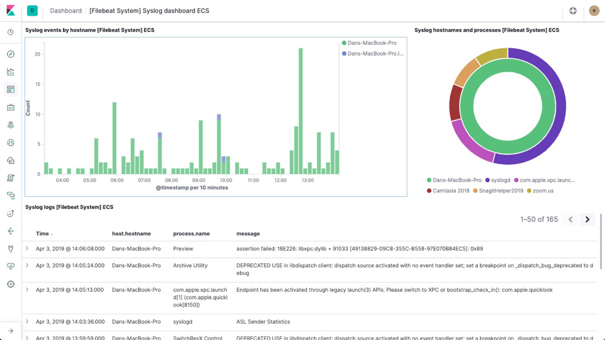

**Nginx**

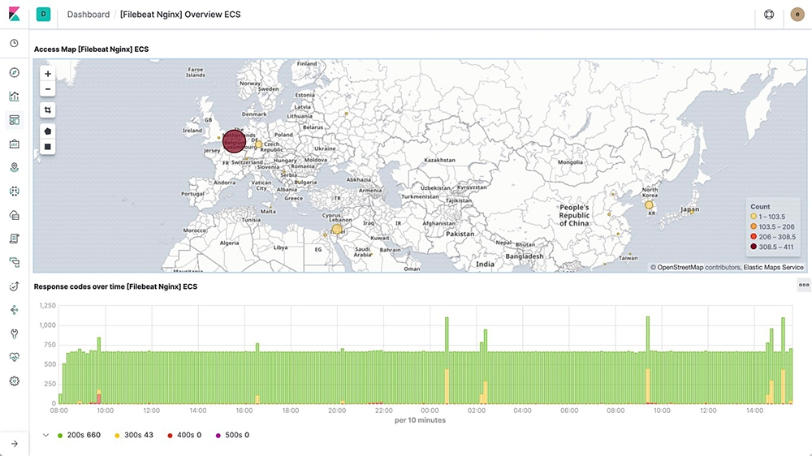

**MySQL**

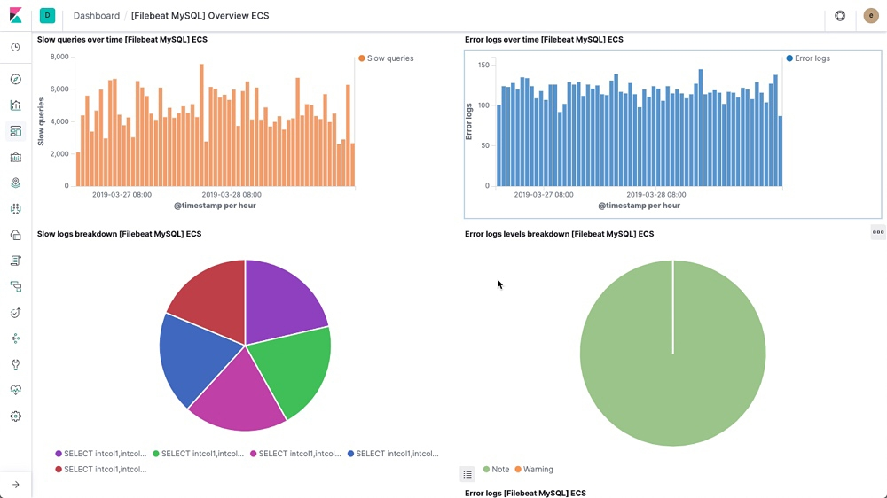

**Audit**

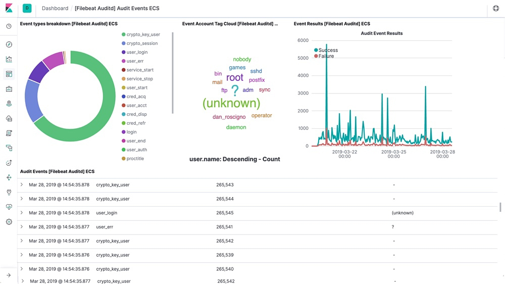


**容器就绪和云端就绪**

正在对所有内容进行容器化，或者正在云端环境中运行？通过 Elastic Stack，可以轻松地[监测容器](https://www.elastic.co/cn/docker-kubernetes-container-monitoring)和云服务。在 Kubernetes、Docker 或云端部署中部署 Filebeat，即可获得所有的日志流：信息十分完整，包括日志流的 pod、容器、节点、VM、主机以及自动关联时用到的其他元数据。此外，Beats Autodiscover 功能可检测到新容器，并使用恰当的 Filebeat 模块对这些容器进行自适应监测。

**它不会导致您的管道过载**

当将数据发送到 Logstash 或 Elasticsearch 时，Filebeat 使用背压敏感协议，以应对更多的数据量。如果 Logstash 正在忙于处理数据，则会告诉 Filebeat 减慢读取速度。一旦拥堵得到解决，Filebeat 就会恢复到原来的步伐并继续传输数据。

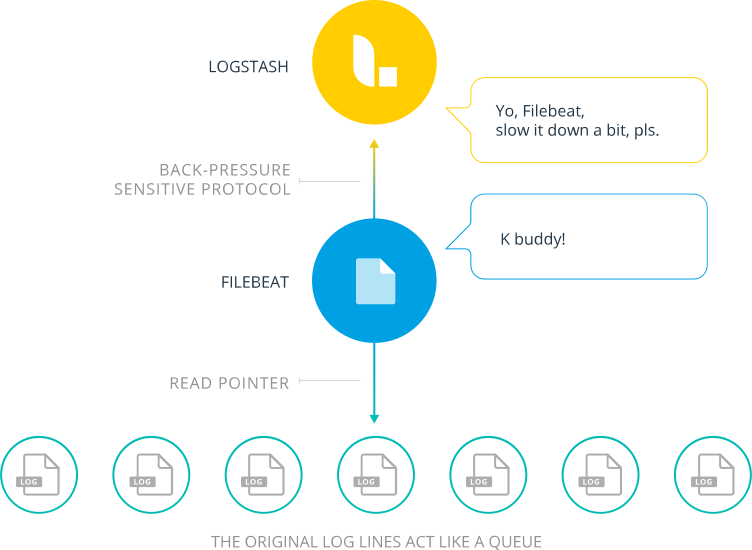

**输送至 Elasticsearch 或 Logstash。在 Kibana 中实现可视化。**

Filebeat 是 Elastic Stack 的一部分，因此能够与 Logstash、Elasticsearch 和 Kibana 无缝协作。无论您要使用 Logstash 转换或充实日志和文件，还是在 Elasticsearch 中随意处理一些数据分析，亦或在 Kibana 中构建和分享仪表板，Filebeat 都能轻松地将您的数据发送至最关键的地方。

**容器监测**

您的应用程序和环境在不断演变，Elastic Stack 亦要如此。 监测和搜索在您的应用程序、Docker 和 Kubernetes 内发生的事情，并对这些事情进行可视化，而且一切均在一个位置集中完成。

**整合**

**在单一平台上查看您的日志和指标**

监测您的应用程序，随时关注 Kubernetes 指标和活动，并且分析 Docker 容器的性能。使用专门针对基础架构操作而构建的单个 UI，便可对所有这些内容进行可视化和搜索。指标和日志在这里和谐共存。

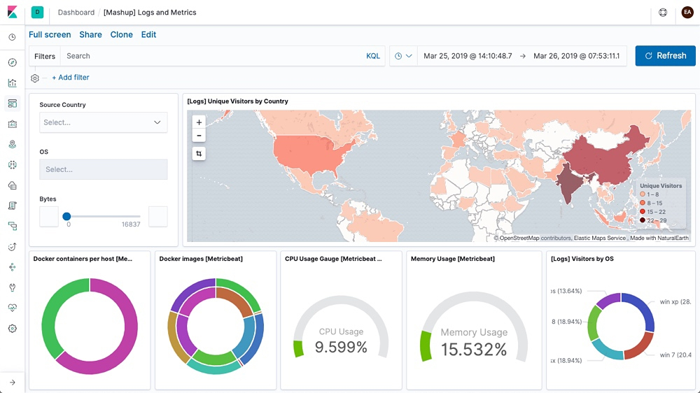

**自动发现**

**Beats 针对您平台的动态特性做出反应**

[Metricbeat 和 Filebeat 的自动发现功能](https://www.elastic.co/cn/webinars/elasticsearch-log-collection-with-kubernetes-docker-and-containers)能够让您随时了解环境中的变化。通过使用 Docker 和 Kubernetes API 挂钩函数，实现模块和日志路径添加的自动化，并调整监测设置。然后[添加元数据](https://www.elastic.co/cn/blog/shipping-kubernetes-logs-to-elasticsearch-with-filebeat)，这样您便能知道所有数据的初始点。

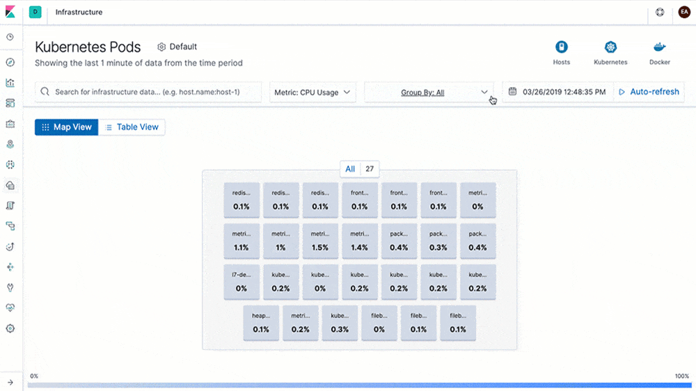

**实现数据可视化，获取变更通知**

借助预配置的 Kibana 仪表板，满怀热情地开始使用之旅。然后创建自定义仪表板和告警，随时了解最重要的指标。您的系统中有新容器吗？您的应用程序、Docker 和 Kubernetes 的运行状况如何？对变化进行可视化，确定问题，进行控制，然后接收通知。 没有问题。

**应用程序**

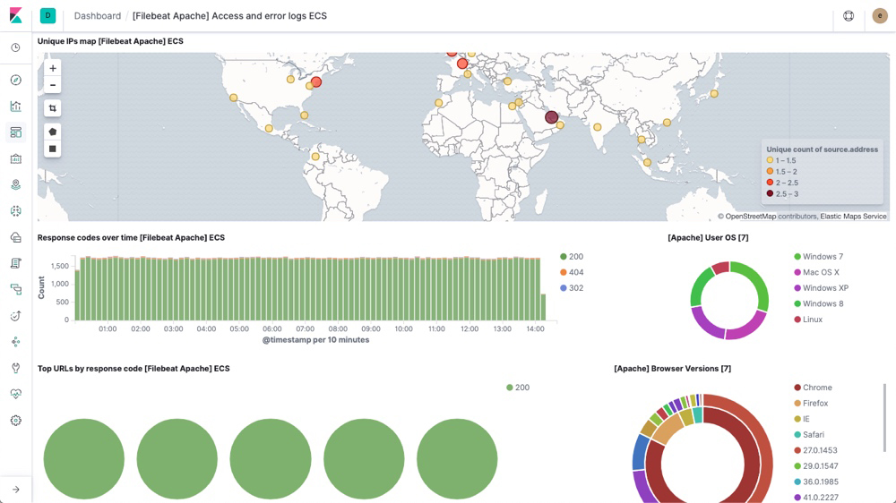

**Docker**

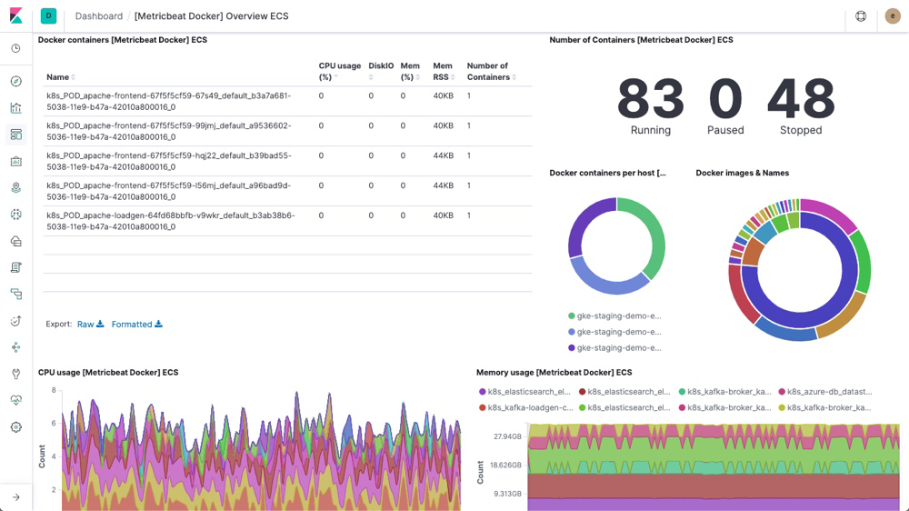

**Kubernetes**

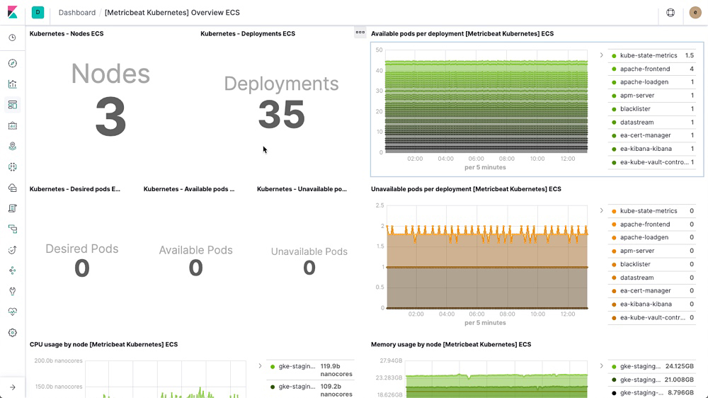


4.2


**Running Filebeat on Kubernetesedit**

<https://www.elastic.co/guide/en/beats/filebeat/current/running-on-kubernetes.html>


# 5 HeartBeat

## 5.1  HeartBeat概述

Heartbeat是一个轻量级守护程序，可以安装在远程服务器上，定期检查服务状态并确定它们是否可用。与[Metricbeat](https://www.elastic.co/guide/en/beats/metricbeat/7.1/index.html)不同，[Metricbeat](https://www.elastic.co/guide/en/beats/metricbeat/7.1/index.html)仅告诉您服务器是启动还是关闭，Heartbeat会告诉您服务是否可访问。

当您需要验证是否符合服务正常运行时的服务级别协议时，Heartbeat非常有用。当您需要验证外部没有人可以访问您的私有企业服务器上的服务时，它对于其他方案（例如安全用例）也很有用。

您可以将Heartbeat配置为ping指定主机名的所有DNS可解析IP地址。这样，您可以检查所有负载平衡的服务，以查看它们是否可用。

配置Heartbeat时，指定用于标识要检查的主机名的monitor 。每个monitor 都根据您指定的计划运行。例如，您可以将一台monitor 配置为每10分钟运行一次，将另一台monitor 配置为在9:00到17:00之间运行。

Heartbeat目前支持通过以下方式检查主机的监视器：

- ICMP（v4和v6）回应请求。`icmp`只需要检查服务是否可用时，请使用显示器。此监视器需要root访问权限。
- TCP。使用`tcp`监视器通过TCP连接。您可以选择配置此监视器，以通过发送和/或接收自定义有效负载来验证端点。
- HTTP。使用`http`监视器通过HTTP连接。您可以选择配置此监视器以验证服务是否返回预期的响应，例如特定的状态代码，响应标头或内容。

在`tcp`和`http`显示器都支持SSL / TLS和一些代理设置。

心跳是一种弹性[节拍](https://www.elastic.co/products/beats)。它基于`libbeat`框架。有关更多信息，请参阅 [Beats Platform Reference](https://www.elastic.co/guide/en/beats/libbeat/7.1/index.html)。

## 5.2   Heartbeat 入门

要开始使用您自己的Heartbeat设置，请安装并配置这些相关产品：

- 用于存储和索引数据的Elasticsearch。
- 用户界面的Kibana。
- Logstash（可选）用于解析和增强数据。

有关安装这些产品的详细信息，请参阅[Elastic Stack入门](https://www.elastic.co/guide/en/elastic-stack-get-started/7.1/get-started-elastic-stack.html)。

### 5.2.1  安装Heartbeat 

​	与在边缘节点上安装的大多数Beats不同，您通常将Heartbeat安装为在单独的计算机上运行的监视服务的一部分，甚至可能在运行您要监视的服务的网络之外。

**rpm:**

```sh
curl -L -O https://artifacts.elastic.co/downloads/beats/heartbeat/heartbeat-7.0.1-x86_64.rpm
sudo rpm -vi heartbeat-7.0.1-x86_64.rpm
```

**mac:**

```sh
curl -L -O https://artifacts.elastic.co/downloads/beats/heartbeat/heartbeat-7.0.1-darwin-x86_64.tar.gz
tar xzvf heartbeat-7.0.1-darwin-x86_64.tar.gz
```

**linux:**

```sh
curl -L -O https://artifacts.elastic.co/downloads/beats/heartbeat/heartbeat-7.0.1-linux-x86_64.tar.gz
tar xzvf heartbeat-7.0.1-linux-x86_64.tar.gz
```

**docker:**

See [Running on Docker](https://www.elastic.co/guide/en/beats/heartbeat/7.0/running-on-docker.html) for deploying Docker containers.

**win:**

1. Download the Heartbeat Windows zip file from the [downloads page](https://www.elastic.co/downloads/beats/heartbeat).

2. Extract the contents of the zip file into `C:\Program Files`.

3. Rename the `heartbeat-<version>-windows` directory to `Heartbeat`.

4. Open a PowerShell prompt as an Administrator (right-click the PowerShell icon and select **Run As Administrator**).

5. From the PowerShell prompt, run the following commands to install Heartbeat as a Windows service:

   ```sh
   PS > cd 'C:\Program Files\Heartbeat'
   PS C:\Program Files\Heartbeat> .\install-service-heartbeat.ps1
   ```

在启动Heartbeat之前，您应该查看配置文件中的配置选项，例如`C:\Program Files\Heartbeat\heartbeat.yml` 或`/etc/heartbeat/heartbeat.yml`。有关这些选项的更多信息，请参阅配置Heartbeat。

### 5.2.2  配置Heartbeat 

要配置Heartbeat，请编辑配置文件。调用默认配置文件 heartbeat.yml。文件的位置因平台而异。要找到该文件，请参阅目录布局。

还有一个名为的完整示例配置文件heartbeat.reference.yml ，显示了所有未弃用的选项。

Heartbeat提供监视器以按设定的间隔检查主机的状态。您可以单独配置每个监视器 Heartbeat当前为ICMP，TCP和HTTP提供监视器（有关这些监视器的更多信息，请参阅[*概述*](https://www.elastic.co/guide/en/beats/heartbeat/current/heartbeat-overview.html)）。以下是配置Heartbeat以使用`icmp` 监视器的示例：

```yaml
heartbeat.monitors:
- type: icmp
  schedule: '*/5 * * * * * *'
  hosts: ["myhost"]
output.elasticsearch:
  hosts: ["myEShost:9200"]
```

配置Heartbeat：

1. 指定要启用的监视器列表。列表中的每个项目都以短划线（ - ）开头。以下示例将Heartbeat配置为使用两个监视器，一个`icmp`监视器和一个`tcp`监视器：

```yaml
heartbeat.monitors:
- type: icmp
  schedule: '*/5 * * * * * *' 
  hosts: ["myhost"]
- type: tcp
  schedule: '@every 5s' 
  hosts: ["myhost:12345"]
  mode: any
```

1. 该icmp显示器预定（10:00:00，10点00分05秒，等等）正好运行每5秒。该schedule选项使用基于此cronexpr实现的类似cron的语法 。
2. 该tcp显示器被设置心跳开始时，每5秒从时间运行。Heartbeat将@every关键字添加到cronexpr包提供的语法中 。
3. 该mode指定是否来ping一个IP（ any）或全解析（IPS all）。

有关每个配置选项的完整说明，请参阅配置Heartbeat。

配置输出。Heartbeat支持各种 输出，但通常您可以将事件直接发送到Elasticsearch，也可以发送到Logstash以进行其他处理。
要将输出直接发送到Elasticsearch（不使用Logstash），请设置Elasticsearch安装的位置：

​	1、如果您 在Elastic Cloud上运行我们 [托管的Elasticsearch Service](https://www.elastic.co/cloud/elasticsearch-service)，请指定您的[Cloud ID](https://www.elastic.co/guide/en/beats/heartbeat/current/configure-cloud-id.html)。例如：

```
cloud.id：“staging：dXMtZWFzdC0xLmF3cy5mb3VuZC5pbyRjZWM2ZjI2MWE3NGJmMjRjZTMzYmI4ODExYjg0Mjk0ZiRjNmMyY2E2ZDA0MjI0OWFmMGNjN2Q3YTllOTYyNTc0Mw ==”
```

​	2、如果您在自己的硬件上运行Elasticsearch，请设置Heartbeat可以找到Elasticsearch安装的主机和端口。例如

```
output.elasticsearch:
  hosts: ["myEShost:9200"]
```

要将输出发送到Logstash，请 改为配置Logstash输出。对于所有其他输出，请参阅配置输出。

​	3、如果您计划使用Heartbeat随附的示例Kibana仪表板，请配置Kibana端点。如果Kibana与Elasticsearch在同一主机上运行，则可以跳过此步骤。

```
setup.kibana:
  host: "mykibanahost:5601"
```

​	例如，运行Kibana的计算机的主机名和端口`mykibanahost:5601`。如果在端口号后面指定路径，请包括方案和端口：`http://mykibanahost:5601/path`。

​	4、如果Elasticsearch和Kibana受到保护，请在heartbeat.yml运行设置和启动Heartbeat的命令之前在配置文件中设置凭据。

```
output.elasticsearch:
  hosts: ["myEShost:9200"]
  username: "filebeat_internal"
  password: "YOUR_PASSWORD" 
setup.kibana:
  host: "mykibanahost:5601"
  username: "my_kibana_user"  
  password: "YOUR_PASSWORD"
```

1. 此示例显示了硬编码密码，但您应将敏感值存储在secrets密钥库中。

2. 该username和password为Kibana设置可选。如果未指定Kibana的凭据，Heartbeat将使用 为Elasticsearch输出指定的username和password。

3. 要使用预先构建的Kibana仪表板，此用户必须具有 kibana_user 内置角色或同等权限。


有关更多信息，请参阅保护心跳。

### 5.2.3  在Elasticsearch中加载索引模板

加载索引模板需要连接到Elasticsearch。如果输出不是Elasticsearch，则必须 手动加载模板。

在Elasticsearch中，索引模板用于定义确定如何分析字段的设置和映射。

Heartbeat软件包安装了Heartbeat的推荐索引模板文件。如果接受heartbeat.yml配置文件中的默认配置 ，Heartbeat会在成功连接到Elasticsearch后自动加载模板。如果模板已存在，则除非您配置Heartbeat，否则不会覆盖该模板。

**配置模板加载编辑**
默认情况下，fields.yml如果启用了Elasticsearch输出，Heartbeat会自动加载推荐的模板文件 。如果要使用默认索引模板，则不需要其他配置。否则，您可以将heartbeat.yml配置文件中的默认值更改为：

**加载不同的模板**

```
setup.template.name: "your_template_name"
setup.template.fields: "path/to/fields.yml"
```

如果模板已存在，则除非您配置Heartbeat，否则不会覆盖该模板。

覆盖现有模板

```
setup.template.overwrite：true
```

禁用自动模板加载

```
setup.template.enabled：false
```

如果禁用自动模板加载，则需要 [手动加载模板](https://www.elastic.co/guide/en/beats/heartbeat/current/heartbeat-template.html#load-template-manually)。

**更改索引名称**

默认情况下，Heartbeat将事件写入命名的索引 `heartbeat-7.1.0-yyyy.MM.dd`，其中`yyyy.MM.dd`是事件索引的日期。要使用其他名称，请[`index`](https://www.elastic.co/guide/en/beats/heartbeat/current/elasticsearch-output.html#index-option-es)在Elasticsearch输出中设置该 选项。您指定的值应包括索引的根名称以及版本和日期信息。您还需要配置`setup.template.name`和`setup.template.pattern`选项以匹配新名称。例如：

```
output.elasticsearch.index: "customname-%{[agent.version]}-%{+yyyy.MM.dd}"
setup.template.name: "customname"
setup.template.pattern: "customname-*"
```

通过Kibana UI加载仪表板时，请记住更改索引名称。

有关配置选项的完整列表，请参阅加载Elasticsearch索引模板。

**手动加载模板编辑**

要手动加载模板，请运行该[`setup`](https://www.elastic.co/guide/en/beats/heartbeat/current/command-line-options.html#setup-command)命令。需要连接到Elasticsearch。如果启用了另一个输出，则需要临时禁用该输出并使用该`-E`选项启用Elasticsearch 。此处的示例假定已启用Logstash输出。`-E`如果已启用Elasticsearch输出，则可以省略标志。

如果要连接到安全的Elasticsearch集群，请确保已按步骤2：配置心跳中所述配置凭据。

如果运行Heartbeat的主机没有与Elasticsearch的直接连接，请参阅手动加载模板（备用方法）。

要加载模板，请使用适用于您系统的命令。

**deb and rpm:**

```
heartbeat setup --template -E output.logstash.enabled=false -E 'output.elasticsearch.hosts=["localhost:9200"]'
```

**mac:**

```
./heartbeat setup --template -E output.logstash.enabled=false -E 'output.elasticsearch.hosts=["localhost:9200"]'
```

**win:**

Open a PowerShell prompt as an Administrator (right-click the PowerShell icon and select **Run As Administrator**).

From the PowerShell prompt, change to the directory where you installed Heartbeat, and run:

```sh
PS > .\heartbeat.exe setup --template -E output.logstash.enabled=false -E 'output.elasticsearch.hosts=["localhost:9200"]'
```


 **强制Kibana查看最新的文档**

如果您已使用Heartbeat将数据索引到Elasticsearch，则索引可能包含旧文档。加载索引模板后，您可以删除旧文档`heartbeat-*`以强制Kibana查看最新文档。

使用此命令

**deb and rpm:**

```sh
curl -XDELETE 'http://localhost:9200/heartbeat-*'
```

**mac:**

```sh
curl -XDELETE 'http://localhost:9200/heartbeat-*'
```

**linux:**

```sh
curl -XDELETE 'http://localhost:9200/heartbeat-*'
```

**win:**

```sh
PS > Invoke-RestMethod -Method Delete "http://localhost:9200/heartbeat-*"
```

此命令删除与模式匹配的所有索引`heartbeat-*`。在运行此命令之前，请确保要删除与该模式匹配的所有索引。

###  手动加载模板（备用方法）

如果运行Heartbeat的主机没有与Elasticsearch的直接连接，则可以将索引模板导出到文件，将其移动到具有连接的计算机，然后手动安装模板。

要导出索引模板，请运行：

**deb and rpm:**

```sh
heartbeat export template > heartbeat.template.json
```

**mac:**

```sh
./heartbeat export template > heartbeat.template.json
```

**linux:**

```sh
./heartbeat export template > heartbeat.template.json
```

**win:**

```sh
PS > .\heartbeat.exe export template --es.version 7.1.0 | Out-File -Encoding UTF8 heartbeat.template.json
```

To install the template, run:

**deb and rpm:**

```sh
curl -XPUT -H 'Content-Type: application/json' http://localhost:9200/_template/heartbeat-7.1.0 -d@heartbeat.template.json
```

**mac:**

```sh
curl -XPUT -H 'Content-Type: application/json' http://localhost:9200/_template/heartbeat-7.1.0 -d@heartbeat.template.json
```

**linux:**

```sh
curl -XPUT -H 'Content-Type: application/json' http://localhost:9200/_template/heartbeat-7.1.0 -d@heartbeat.template.json
```

**win:**

```sh
PS > Invoke-RestMethod -Method Put -ContentType "application/json" -InFile heartbeat.template.json -Uri http://localhost:9200/_template/heartbeat-7.1.0
```

### 5.2.4  设置Kibana仪表板

可以在[uptime-contrib](https://github.com/elastic/uptime-contrib) github存储库中找到Heartbeat的仪表板。

### 5.2.5  启动Heartbeat 

**deb and rpm:**

```sh
sudo service heartbeat-elastic start
```

**mac and linux:**

```sh
sudo chown root heartbeat.yml 
sudo ./heartbeat -e
```

您将以root身份运行Heartbeat，因此您需要更改配置文件的所有权，或者使用--strict.perms=false指定的方式运行Heartbeat 。请参阅 Beats平台参考 中的配置文件所有权和权限。

**win:**

```sh
PS C:\Program Files\Heartbeat> Start-Service heartbeat
```

默认情况下，Windows日志文件存储在`C:\ProgramData\heartbeat\Logs`。

现在，Heartbeat已准备好检查服务的状态并将事件发送到您定义的输出。


### 5.2.6  查看示例Kibana仪表板

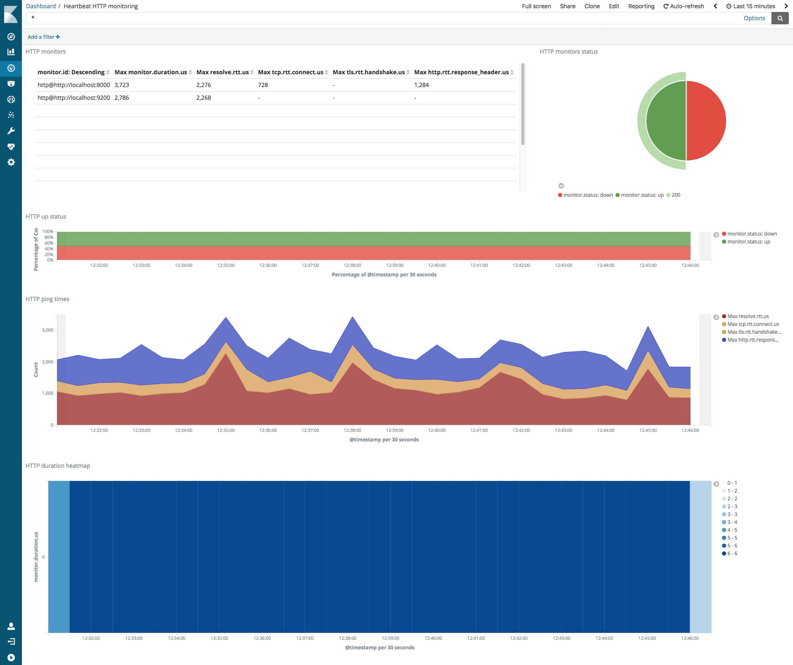

### 5.2.7  APT和YUM的存储库安装Heartbeat 

####  YUM

要为YUM添加Beats存储库：

1. 下载并安装公共签名密钥：

```
sudo rpm --import https://packages.elastic.co/GPG-KEY-elasticsearch
```

  2.在目录中 创建一个带`.repo`扩展名的文件（例如`elastic.repo`），`/etc/yum.repos.d/`并添加以下行：

```
[elastic-7.x]
name=Elastic repository for 7.x packages
baseurl=https://artifacts.elastic.co/packages/7.x/yum
gpgcheck=1
gpgkey=https://artifacts.elastic.co/GPG-KEY-elasticsearch
enabled=1
autorefresh=1
type=rpm-md
```

该软件包可以在Elastic许可下免费使用。还提供了另一个包，其中仅包含Apache 2.0许可下提供的功能。要安装它，请`baseurl`在您的 `.repo`文件中使用以下内容：

```sh
baseURL时= HTTPS：//artifacts.elastic.co/packages/oss-7.x/yum
```

您的存储库已准备就绪。例如，您可以通过运行以下命令安装Heartbeat：

```
sudo yum install heartbeat-elastic
```

  3.要将Beat配置为在引导期间自动启动，请运行：

```
sudo chkconfig --add heartbeat-elastic
```


### 5.3  设置和运行Heartbeat

### 5.3.1  目录布局

安装目录布局如下

| Type       | Description                                     | Default Location   | Config Option |
| ---------- | ----------------------------------------------- | ------------------ | ------------- |
| **home**   | Home of the Heartbeat installation.             | ``                 | `path.home`   |
| **bin**    | The location for the binary files.              | `{path.home}/bin`  | ``            |
| **config** | The location for configuration files.           | `{path.home}`      | `path.config` |
| **data**   | The location for persistent data files.         | `{path.home}/data` | `path.data`   |
| **logs**   | The location for the logs created by Heartbeat. | `{path.home}/logs` | `path.logs`   |

**默认路径**
Heartbeat使用以下默认路径，除非您明确更改它们。

| Type       | Description                                     | Location                   |
| ---------- | ----------------------------------------------- | -------------------------- |
| **home**   | Home of the Heartbeat installation.             | `/usr/share/heartbeat`     |
| **bin**    | The location for the binary files.              | `/usr/share/heartbeat/bin` |
| **config** | The location for configuration files.           | `/etc/heartbeat`           |
| **data**   | The location for persistent data files.         | `/var/lib/heartbeat`       |
| **logs**   | The location for the logs created by Heartbeat. | `/var/log/heartbeat`       |

对于deb和rpm分发，这些路径在init脚本或systemd单元文件中设置。确保使用首选操作系统方法（init脚本或systemctl）启动Heartbeat服务。否则，路径可能设置不正确。

#####  docker

| Type       | Description                                     | Location                    |
| ---------- | ----------------------------------------------- | --------------------------- |
| **home**   | Home of the Heartbeat installation.             | `/usr/share/heartbeat`      |
| **bin**    | The location for the binary files.              | `/usr/share/heartbeat`      |
| **config** | The location for configuration files.           | `/usr/share/heartbeat`      |
| **data**   | The location for persistent data files.         | `/usr/share/heartbeat/data` |
| **logs**   | The location for the logs created by Heartbeat. | `/usr/share/heartbeat/logs` |

zip，tar.gz或tgz

| Type       | Description                                     | Location              |
| ---------- | ----------------------------------------------- | --------------------- |
| **home**   | Home of the Heartbeat installation.             | `{extract.path}`      |
| **bin**    | The location for the binary files.              | `{extract.path}`      |
| **config** | The location for configuration files.           | `{extract.path}`      |
| **data**   | The location for persistent data files.         | `{extract.path}/data` |
| **logs**   | The location for the logs created by Heartbeat. | `{extract.path}/logs` |

对于zip，tar.gz或tgz发行版，这些路径基于提取的二进制文件的位置。这意味着如果使用以下简单命令启动Heartbeat，则所有路径都已正确设置：

```sh
./heartbeat
```

### 5.3.2  命令参考

Heartbeat提供了一个命令行界面，用于启动Heartbeat并执行常见任务，例如测试配置文件。

命令行还支持 用于控制全局行为的[全局标志](https://www.elastic.co/guide/en/beats/heartbeat/current/command-line-options.html#global-flags)。

| 命令                                                         |                                                              |
| ------------------------------------------------------------ | ------------------------------------------------------------ |
| [`export`](https://www.elastic.co/guide/en/beats/heartbeat/current/command-line-options.html#export-command) | 将配置或索引模板导出到stdout。                               |
| [`help`](https://www.elastic.co/guide/en/beats/heartbeat/current/command-line-options.html#help-command) | 显示任何命令的帮助。                                         |
| [`keystore`](https://www.elastic.co/guide/en/beats/heartbeat/current/command-line-options.html#keystore-command) | 管理[秘密密钥库](https://www.elastic.co/guide/en/beats/heartbeat/current/keystore.html)。 |
| [`run`](https://www.elastic.co/guide/en/beats/heartbeat/current/command-line-options.html#run-command) | 运行心跳。如果在未指定命令的情况下启动Heartbeat，则默认使用此命令。 |
| [`setup`](https://www.elastic.co/guide/en/beats/heartbeat/current/command-line-options.html#setup-command) | 设置初始环境，包括ES索引模板。                               |
| [`test`](https://www.elastic.co/guide/en/beats/heartbeat/current/command-line-options.html#test-command) | 测试配置。                                                   |
| [`version`](https://www.elastic.co/guide/en/beats/heartbeat/current/command-line-options.html#version-command) | 显示有关当前版本的信息。                                     |

### 5.3.3  在Docker上运行Heartbeat

使用setup命令运行Heartbeat将创建索引模式并加载可视化和机器学习作业。运行此命令：

```
docker run \
docker.elastic.co/beats/heartbeat:7.1.0 \
setup -E setup.kibana.host=kibana:5601 \
-E output.elasticsearch.hosts=["elasticsearch:9200"] 
```

1. Substitute your Kibana and Elasticsearch hosts and ports.

2. If you are using the hosted Elasticsearch Service in Elastic Cloud, replace the -E output.elasticsearch.hosts line with the Cloud ID and elastic password using this syntax:

```
-E cloud.id=<Cloud ID from Elasticsearch Service> \
-E cloud.auth=elastic:<elastic password>
```

### 在Docker上配置Heartbeat

Docker镜像提供了几种配置Heartbeat的方法。传统方法是通过卷安装提供配置文件，但也可以使用包含的配置创建自定义映像。

下载此示例配置文件作为起点：

```
curl -L -O https://raw.githubusercontent.com/elastic/beats/7.1/deploy/docker/heartbeat.docker.yml
```

#### 卷安装配置

在Docker上配置Heartbeat的一种方法是`heartbeat.docker.yml`通过卷安装提供。使用`docker run`，可以像这样指定卷装：

```
docker run -d \
  --name=heartbeat \
  --user=heartbeat \
  --volume="$(pwd)/heartbeat.docker.yml:/usr/share/heartbeat/heartbeat.yml:ro" \
  docker.elastic.co/beats/heartbeat:7.1.0 \
  --strict.perms=false -e \
  -E output.elasticsearch.hosts=["elasticsearch:9200"]
```

替换您的Elasticsearch主机和端口。

如果您在Elastic Cloud中使用托管的Elasticsearch Service，请-E output.elasticsearch.hosts使用前面显示的语法将该行替换为Cloud ID和弹性密码。

**自定义镜像配置**

可以将Heartbeat配置嵌入自定义图像中。这是一个实现此目的的Dockerfile示例：

```
FROM docker.elastic.co/beats/heartbeat:7.1.0
COPY heartbeat.yml /usr/share/heartbeat/heartbeat.yml
USER root
RUN chown root:heartbeat /usr/share/heartbeat/heartbeat.yml
USER heartbeat
```


### 5.3.4  Heartbeat和systemd

DEB和RPM软件包包括用于具有systemd的Linux系统的服务单元。在这些系统上，您可以使用常用的systemd命令管理Heartbeat。

###  启动和停止 Heartbeat

Use `systemctl` to start or stop Heartbeat:

```sh
systemctl start heartbeat-elastic
systemctl stop heartbeat-elastic
```

By default, the Heartbeat service starts automatically when the system boots. To enable or disable auto start use:

```sh
systemctl enable heartbeat-elastic
systemctl disable heartbeat-elastic
```

### Heartbeat 状态和日志

使用 `systemctl`获取服务状态:

```sh
systemctl status heartbeat-elastic
```

Logs are stored by default in journald. To view the Logs, use `journalctl`:

```sh
journalctl -u heartbeat-elastic.service
```

​	The unit file included in the packages sets the `-e` flag by default. This flag makes Heartbeat log to stderr and disables other log outputs. Systemd stores all output sent to stderr in journald.

### 自定义 Heartbeat服务单元

systemd服务单元文件包含可以覆盖以更改默认选项的环境变量。

| 变量                 | 描述               | 默认值                                                       |
| -------------------- | ------------------ | ------------------------------------------------------------ |
| **BEAT_LOG_OPTS**    | 日志选项           | `-e`                                                         |
| **BEAT_CONFIG_OPTS** | 配置文件路径的标志 | `-c /etc/heartbeat/heartbeat.yml`                            |
| **BEAT_PATH_OPTS**   | 其他路径           | `-path.home /usr/share/heartbeat -path.config /etc/heartbeat -path.data /var/lib/heartbeat -path.logs /var/log/heartbeat` |

要覆盖这些变量，请在`/etc/systemd/system/heartbeat.service.d`目录中创建一个插入式单元文件 。

例如，放置了以下内容的文件 `/etc/systemd/system/heartbeat.service.d/debug.conf` 将覆盖`BEAT_LOG_OPTS`以启用Elasticsearch输出的调试。

```systemd
[Service]
Environment="BEAT_LOG_OPTS=-e -d elasticsearch"
```

要使用Heartbeat文件中的设置，请清空环境变量。例如：

```systemd
[Service]
Environment="BEAT_LOG_OPTS="
```

要应用更改，请重新加载systemd配置并重新启动服务：

```sh
systemctl daemon-reload
systemctl restart heartbeat
```

​	建议您使用配置管理工具来包含插入单元文件。如果您需要手动添加插件，请使用`systemctl edit heartbeat.service`。


## 5.4  配置HeartBeat

要配置Heartbeat，请编辑配置文件。对于rpm和deb，您将找到默认配置文件`/etc/heartbeat/heartbeat.yml`。还有一个完整的示例配置文件，`/etc/heartbeat/heartbeat.reference.yml`其中显示了所有未弃用的选项。对于mac和win，请查看您提取的存档。

Heartbeat配置文件使用[YAML](http://yaml.org/)作为其语法。有关[配置文件](https://www.elastic.co/guide/en/beats/libbeat/7.1/config-file-format.html)结构的更多信息，请参阅*Beats Platform Reference*的 [Config File Format](https://www.elastic.co/guide/en/beats/libbeat/7.1/config-file-format.html)部分 。

设置心跳监视器
指定常规设置
配置内部队列
配置输出
配置索引生命周期管理
指定SSL设置
过滤并增强导出的数据
使用摄取节点解析数据
使用geoIP信息丰富事件
配置项目路径
配置Kibana端点
加载Elasticsearch索引模板
配置日志记录
在配置中使用环境变量
自动发现
YAML提示和陷阱
正则表达式支持
HTTP端点
heartbeat.reference.yml


## 5.5 导出字段

## 5.6  监控HeartBeat

Heartbeat的X-Pack监控需要Elasticsearch 6.2或更高版本。

X-Pack监控使您可以轻松监控来自Kibana的Heartbeat。有关更多信息，请参阅 [监视弹性堆栈](https://www.elastic.co/guide/en/elastic-stack-overview/7.1/xpack-monitoring.html)和 [节拍监视度量标准](https://www.elastic.co/guide/en/kibana/7.1/beats-page.html)。

配置Heartbeat以收集和发送监控指标：

1. 创建具有相应权限的用户，以将系统级监视数据发送到Elasticsearch。例如，您可以使用内置`beats_system`用户或将内置`beats_system`角色分配给其他用户。有关更多信息，请参阅 [设置用户身份验证](https://www.elastic.co/guide/en/elastic-stack-overview/7.1/setting-up-authentication.html)和 [内置角色](https://www.elastic.co/guide/en/elastic-stack-overview/7.1/built-in-roles.html)。
2. `xpack.monitoring`在Heartbeat配置文件中 添加设置。如果您配置了Elasticsearch输出，请指定以下最小配置：

```
xpack.monitoring.enabled：true
```

如果配置了其他输出（例如Logstash），则必须指定其他配置选项。例如：

```
xpack.monitoring:
  enabled: true
  elasticsearch:
    hosts: ["https://example.com:9200", "https://example2.com:9200"]
    username: beats_system
    password: somepassword
```

目前，您必须将监视数据发送到与所有其他事件相同的群集。如果您配置了Elasticsearch输出，请不要在监视配置中指定其他主机。

​	3.[在Kibana中配置监控](https://www.elastic.co/guide/en/kibana/7.1/monitoring-xpack-kibana.html)。

​	4.要验证监控配置，请将Web浏览器指向Kibana主机，然后从侧面导航中选择“监控”。Heartbeat报告的度量标准应在Beats部分中显示。启用X-Pack安全性后，要查看监视仪表板，您必须以具有`kibana_user`和`monitoring_user`角色的用户身份登录Kibana 。

## 5.6.1  监视配置选项

您可以xpack.monitoring在heartbeat.yml配置文件的部分中 指定以下选项：

**enabled**
该enabled配置是一个布尔值设置来启用或禁用X-组监控。如果设置为true，则启用监视。

默认值为false。

**elasticsearch**
要将Heartbeat指标发送到的Elasticsearch实例。此配置选项包含以下字段：

**bulk_max_size**
单个Elasticsearch批量API索引请求中要批量处理的最大度量标准数。默认是50。有关更多信息，请参阅Elasticsearch。

**backoff.init**
在网络错误后尝试重新连接到Elasticsearch之前等待的秒数。等待backoff.init几秒钟后，Heartbeat尝试重新连接。如果尝试失败，则退避计时器将以指数方式增加到backoff.max。连接成功后，将重置退避定时器。默认值为1秒。

**backoff.max**
在网络错误后尝试连接到Elasticsearch之前等待的最大秒数。默认值为60秒。

**compression_level**
gzip压缩级别。设置此值以0禁用压缩。压缩级别必须在1（最佳速度）到9（最佳压缩）的范围内。默认值为0。增加压缩级别会降低网络使用率，但会增加CPU使用率。

**headers**
要添加到每个请求的自定义HTTP标头。有关更多信息，请参阅 Elasticsearch。

**hosts**
要连接的Elasticsearch节点列表。监控指标以循环顺序分发到这些节点。有关更多信息，请参阅 Elasticsearch。

**max_retries**
失败后重试发送监控指标的次数。在指定的重试次数之后，通常会删除指标。默认值为3。有关更多信息，请参阅Elasticsearch。

**parameters**
使用索引操作在url中传递的HTTP参数字典。

**password**
Heartbeat用于通过Elasticsearch实例进行身份验证以发送监控数据的密码。

**metrics.period**
度量标准发送到Elasticsearch集群的时间间隔（以秒为单位）。生成心跳指标的新快照并计划发布每个期间。默认值为10 * time.Second。

**state.period**
将状态信息发送到Elasticsearch集群的时间间隔（以秒为单位）。生成心跳状态的新快照并计划发布每个时段。默认值为60 * time.Second。

**protocol**
连接到Elasticsearch集群时要使用的协议的名称。选项是：http或https。默认是http。hosts但是，如果为URL指定了URL ，则会在URL中指定的方案覆盖protocol的值。

**proxy_url**
连接到Elasticsearch集群时使用的代理的URL。有关更多信息，请参阅Elasticsearch。

**timeout**
Elasticsearch请求的HTTP请求超时（以秒为单位）。默认是90。

**ssl**
传输层安全性（TLS）或安全套接字层（SSL）参数的配置选项，例如用于基于HTTPS的连接的证书颁发机构（CA）。如果ssl缺少该部分，则主机CA用于与Elasticsearch的HTTPS连接。有关更多信息，请参阅指定SSL设置。

**username**
Heartbeat用于通过Elasticsearch实例进行身份验证以发送监控数据的用户标识。

## 5.7  保护HeartBeat

以下主题提供有关保护Heartbeat进程以及保护Heartbeat与Elastic堆栈中其他产品之间的通信的信息：

### 5.7.1  与Elasticsearch保持安全通信

要保护Heartbeat和Elasticsearch之间的通信，您可以使用HTTPS和基本身份验证。启用X-Pack安全性时，可以使用Elasticsearch的基本身份验证（请参阅 [保护弹性堆栈](https://www.elastic.co/guide/en/elastic-stack-overview/7.1/elasticsearch-security.html)和[*使用X-Pack安全性*](https://www.elastic.co/guide/en/beats/heartbeat/current/securing-beats.html)）。如果您不使用X-Pack安全性，则可以使用Web代理。

这是一个示例配置：

```
output.elasticsearch:
  username: heartbeat 
  password: verysecret 
  protocol: https 
  hosts: ["elasticsearch.example.com:9200"]
```

1. 用于向Elasticsearch进行身份验证的用户名。

2. 用于向Elasticsearch进行身份验证的密码。

3. 此设置启用HTTPS协议。

4. Elasticsearch节点的IP和端口。

```
要混淆密码和其他敏感设置，请使用 secrets密钥库。
```

Heartbeat验证服务器证书的有效性，并仅接受可信证书。创建正确的SSL / TLS基础结构超出了本文档的范围。

默认情况下，Heartbeat使用运行Heartbeat的操作系统中的受信任证书颁发机构列表。您可以将Heartbeat配置为使用特定的CA证书列表，而不是操作系统中的列表。您还可以通过指定服务器要求Beat进行身份验证时使用的证书和密钥来将其配置为使用客户端身份验证。这是一个示例配置：

```
output.elasticsearch:
  username: heartbeat
  password: verysecret
  protocol: https
  hosts: ["elasticsearch.example.com:9200"]
  ssl.certificate_authorities: 
    - /etc/pki/my_root_ca.pem
    - /etc/pki/my_other_ca.pem
  ssl.certificate: "/etc/pki/client.pem" 
  ssl.key: "/etc/pki/key.pem"
```

1. 要信任的CA证书列表

2. SSL客户端身份验证证书的路径

3. 客户端证书密钥

```
对于任何给定连接，SSL / TLS证书必须具有与为其指定的值匹配的主题hosts，否则SSL握手将失败。例如，如果您指定hosts: ["foobar:9200"]，证书必须包含foobar在subject（CN=foobar）中或作为主题备用名称（SAN）。确保主机名解析为正确的IP地址。如果没有可用的DNS，则可以在/etc/hosts （在Unix上）或C:\Windows\System32\drivers\etc\hosts（在Windows上）将IP地址与主机名相关联。
```

### 5.7.2  使用SSL与Logstash进行安全通信

您可以使用SSL相互身份验证来保护Heartbeat和Logstash之间的连接。这可确保Heartbeat仅将加密数据发送到受信任的Logstash服务器，并确保Logstash服务器仅从受信任的Heartbeat客户端接收数据。

要使用SSL相互身份验证：

1. 创建证书颁发机构（CA）并使用它来签署您计划用于Heartbeat和Logstash的证书。创建正确的SSL / TLS基础结构超出了本文档的范围。有许多可用的在线资源描述了如何创建证书。

```
如果您使用的是X-Pack安全性，则可以使用 elasticsearch-certutil工具生成证书。
```

​    2.配置Heartbeat以使用SSL。在`heartbeat.yml`配置文件中，在以下位置指定以下设置 `ssl`：

- `certificate_authorities`：配置Heartbeat以信任由指定CA签名的任何证书。如果`certificate_authorities`为空或未设置，则使用主机系统的受信任证书颁发机构。

- `certificate`和`key`：指定Heartbeat用于通过Logstash进行身份验证的证书和密钥。

  例如：

```
output.logstash:
  hosts: ["logs.mycompany.com:5044"]
  ssl.certificate_authorities: ["/etc/ca.crt"]
  ssl.certificate: "/etc/client.crt"
  ssl.key: "/etc/client.key"
```

有关这些配置选项的详细信息，请参阅[*指定SSL设置*](https://www.elastic.co/guide/en/beats/heartbeat/current/configuration-ssl.html)。

​	3.配置Logstash以使用SSL。在Logstash配置文件中，[为Logstash](https://www.elastic.co/guide/en/logstash/current/plugins-inputs-beats.html)的[Beats输入插件](https://www.elastic.co/guide/en/logstash/current/plugins-inputs-beats.html)指定以下设置：

- `ssl`：设置为true时，启用Logstash以使用SSL / TLS。

- `ssl_certificate_authorities`：将Logstash配置为信任由指定CA签名的任何证书。

- `ssl_certificate`和`ssl_key`：指定Logstash用于向客户端进行身份验证的证书和密钥。

- `ssl_verify_mode`：指定Logstash服务器是否针对CA验证客户端证书。您需要指定任一`peer`或`force_peer`使服务器要求的证书和验证。如果指定`force_peer`，并且Heartbeat未提供证书，则将关闭Logstash连接。如果您选择不使用[certutil](https://www.elastic.co/guide/en/elasticsearch/reference/7.1/certutil.html)，则您获得的证书必须允许两者`clientAuth`以及`serverAuth`是否存在扩展密钥用法扩展。

  例如：

```
input {
  beats {
    port => 5044
    ssl => true
    ssl_certificate_authorities => ["/etc/ca.crt"]
    ssl_certificate => "/etc/server.crt"
    ssl_key => "/etc/server.key"
    ssl_verify_mode => "force_peer"
  }
}
```

有关这些选项的更多信息，请参阅[Beats输入插件](https://www.elastic.co/guide/en/logstash/current/plugins-inputs-beats.html)的 [文档](https://www.elastic.co/guide/en/logstash/current/plugins-inputs-beats.html)。

###  验证Logstash服务器的证书

在运行Heartbeat之前，您应该验证Logstash服务器的证书。`curl`即使用于与Logstash通信的协议不基于HTTP，您也可以使用它来验证证书。例如：

```
curl -v --cacert ca.crt https://logs.mycompany.com:5044
```

如果测试成功，您将收到一个空响应错误：

```
* Rebuilt URL to: https://logs.mycompany.com:5044/
*   Trying 192.168.99.100...
* Connected to logs.mycompany.com (192.168.99.100) port 5044 (#0)
* TLS 1.2 connection using TLS_DHE_RSA_WITH_AES_256_CBC_SHA
* Server certificate: logs.mycompany.com
* Server certificate: mycompany.com
> GET / HTTP/1.1
> Host: logs.mycompany.com:5044
> User-Agent: curl/7.43.0
> Accept: */*
>
* Empty reply from server
* Connection #0 to host logs.mycompany.com left intact
curl: (52) Empty reply from server
```

以下示例使用IP地址而不是主机名来验证证书：

```shell
curl -v --cacert ca.crt https://192.168.99.100:5044
```

验证此测试失败，因为证书对指定的IP地址无效。它仅对`logs.mycompany.com`证书的“主题”字段中显示的主机名有效。验证此测试失败，因为证书对指定的IP地址无效。它仅对`logs.mycompany.com`证书的“主题”字段中显示的主机名有效。

```
* Rebuilt URL to: https://192.168.99.100:5044/
*   Trying 192.168.99.100...
* Connected to 192.168.99.100 (192.168.99.100) port 5044 (#0)
* WARNING: using IP address, SNI is being disabled by the OS.
* SSL: certificate verification failed (result: 5)
* Closing connection 0
curl: (51) SSL: certificate verification failed (result: 5)
```

有关解决此问题的信息，请参阅[故障排除文档](https://www.elastic.co/guide/en/beats/heartbeat/current/faq.html#ssl-client-fails)。

###  测试Beats to Logstash连接

如果您将Heartbeat作为服务运行，请先停止该服务。然后通过在前台运行Heartbeat来测试您的设置，以便您可以快速查看出现的任何错误：

```
heartbeat -c heartbeat.yml -e -v
```

任何错误都将打印到控制台。有关解决常见错误的信息，请参阅[故障排除文档](https://www.elastic.co/guide/en/beats/heartbeat/current/faq.html#ssl-client-fails)。


### 5.7.3  使用X-Pack安全性

<https://www.elastic.co/guide/en/beats/heartbeat/current/securing-beats.html>

### 5.7.4  使用Linux安全计算模式（seccomp）

<https://www.elastic.co/guide/en/beats/heartbeat/current/linux-seccomp.html>

5.8  


